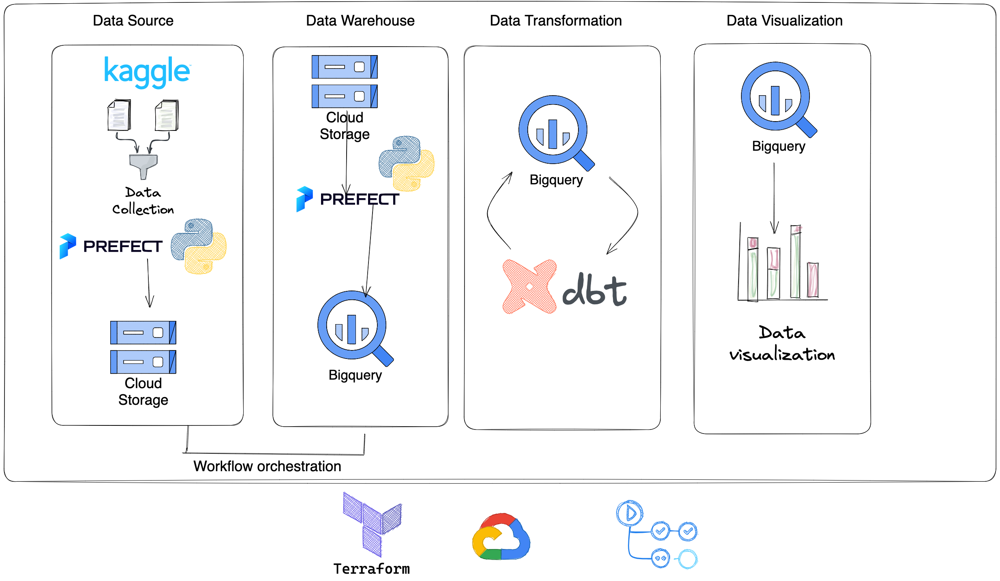
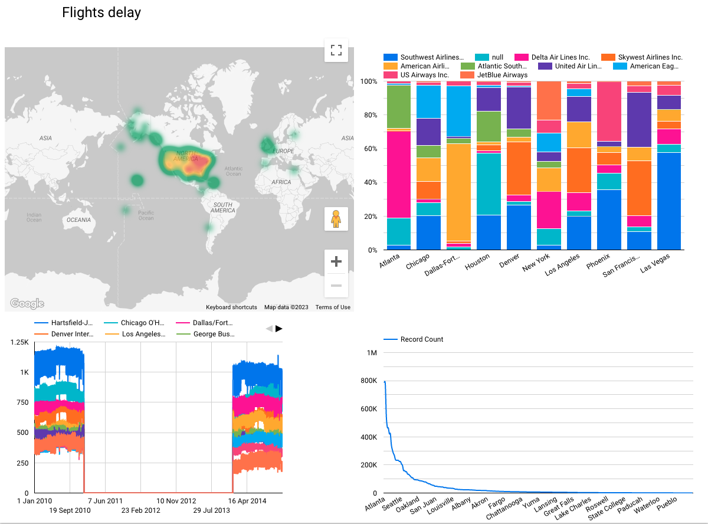
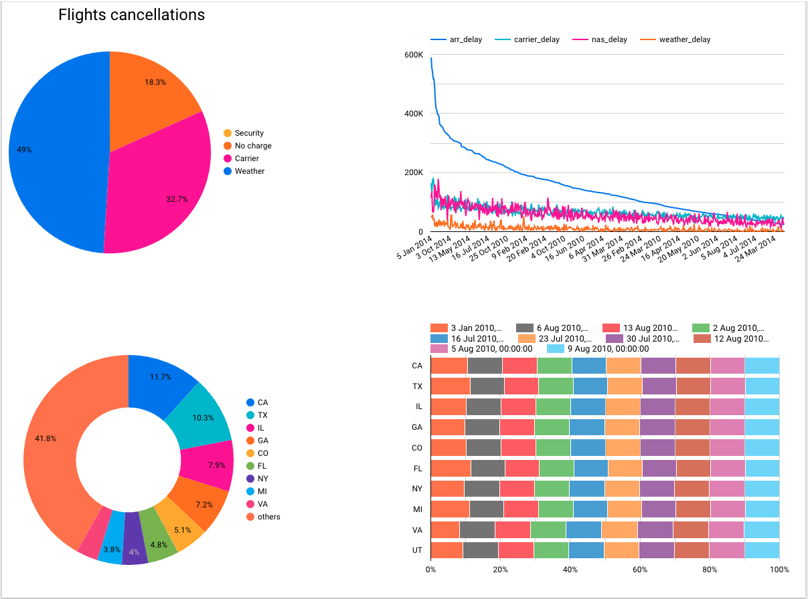

# Analytics of Airline Delays of US Airports
- [Analytics of Airline Delays of US Airports](#analytics-of-airline-delays-of-us-airports)
  - [Preface](#preface)
    - [Problem](#problem)
    - [Repository Structure](#repository-structure)
    - [How to run it](#how-to-run-it)
      - [DBT documentation](#dbt-documentation)
  - [Visualization](#visualization)
      - [Page 1 : Flights Delay](#page-1--flights-delay)
      - [Page 2 : Flights Cancellations](#page-2--flights-cancellations)

***
## Preface 
For my data engineering course project, I chose to utilize [Airline Delay and Cancellation Data, 2009 - 2018](https://www.kaggle.com/datasets/yuanyuwendymu/airline-delay-and-cancellation-data-2009-2018). The dataset is about XYZ. It has a few limitations, however. Firstly, it is divided into yearly segments spanning from 2009 to 2018. Additionally, the information is not easily extractable as there is little metadata. For example, the use of airline and airport codes may pose a challenge as there is no accompanying information within the dataset to identify these codes. To overcome this issue, I was able to source supplementary CSV files that contain details on each airport’s location, state, city and corresponding airport code.


***
### Problem
This dataset is not readily analyzable and there are few obstacles for data analysis, however. it just referred to airline code or airport code which we cant have some insightful from the dataset without know State, city , airport name , airline name …


<!-- style="float: left; margin-right: 10px;" -->

<!-- [System ](./system-structure.png) -->


***

### Repository Structure

- ### Infrastructure as Code
`terraform`: folder that contain Terraform configurations

`terraform/main.tf`: include terraform for Google Cloud image

`terraform/variable.tf`: include terraform variables for Google Cloud image

- #### Data
`/data/csv`: the raw data after downloading it from Kaggle

`data/parquet`: parquet files

`data/`: include lookup tables for airline and airports codes

- #### Processing

`processing/flow`: that contains transform and uploading raw data from local to Google Cloud Bucket then from Bucket to Google Cloud

[DHW Queries for Partitioning and Clustering](./DHW-queries.md)

update readme
***
### How to run it
-  Download the dataset from [Airline Delay and Cancellation Data, 2009 - 2018
 ](https://www.kaggle.com/datasets/yuanyuwendymu/airline-delay-and-cancellation-data-2009-2018)

- Move the dataset to `data/csv` folder in the code 

- Run the Python Script `processing/flow/etl_to_gcs.py` 
  ```python
  python ./processing/flow/etl_to_gcs.py    
  ```
- Run the python Script `processing/flow/etl_gcs_to_bq.py`
  ```python
  python ./processing/flow/etl_gcs_to_bq.py 
  ```
- You can find the dbt files in second the branch called `dbt-model`
- Extra bonus feedback 
  - Go to your Google data studio and connect your BigQuery with the Dashboard Studio
  
- You can find BigQuery Queries for partitioning and clustering in [code](./DHW-queries.md)
  
#### DBT documentation


https://cloud.getdbt.com/accounts/148444/runs/138771363/docs/#!/overview

<!-- ## Introduction
The Airline delays and cancellations in USA between 2009 and 2018 datasets contain 28 columns and for the process we should clean the data and implement the following:


- Extract the data 
- Exploring the data to have better knowledge about the columns 
- Clean the data (depend on your way of implementation Like Delete NaN rows , find Mean of number etc)
- find the right types of the data
- Terraform setup (IaC) with database schema(optional)
- Data ingestion :
  - Batch/Workflow orchestration (Prefect)
- Data warehouse: Tables are partitioned and clustered 
- Transformations: (DBT)
- Dashboard : Google dashboard
 -->

<!-- *** -->


<!-- ## Dataset Description

There are two types of data in the dataset - zipped csv files.

```python
    Index(['FL_DATE', 'OP_CARRIER', 'OP_CARRIER_FL_NUM', 'ORIGIN', 'DEST',
       'CRS_DEP_TIME', 'DEP_TIME', 'DEP_DELAY', 'TAXI_OUT', 'WHEELS_OFF',
       'WHEELS_ON', 'TAXI_IN', 'CRS_ARR_TIME', 'ARR_TIME', 'ARR_DELAY',
       'CANCELLED', 'CANCELLATION_CODE', 'DIVERTED', 'CRS_ELAPSED_TIME',
       'ACTUAL_ELAPSED_TIME', 'AIR_TIME', 'DISTANCE', 'CARRIER_DELAY',
       'WEATHER_DELAY', 'NAS_DELAY', 'SECURITY_DELAY', 'LATE_AIRCRAFT_DELAY',
       'Unnamed: 27'],


'FL_DATE': The flight date.

'OP_CARRIER': The airline carrier code.
'OP_CARRIER_FL_NUM': The flight number for that airline carrier.

'ORIGIN': The airport code for the origin airport.

'DEST': The airport code for the destination airport.

'CRS_DEP_TIME': The scheduled departure time.

'DEP_TIME': The actual departure time.
'DEP_DELAY': The difference in minutes between the scheduled and actual departure time.

'TAXI_OUT': The amount of time in minutes it took for the plane to taxi from the gate to the runway.
'WHEELS_OFF': The actual time when the plane left the gate.
'CRS_ELAPSED_TIME': The scheduled flight time in minutes.
'ACTUAL_ELAPSED_TIME': The actual flight time in minutes.
'AIR_TIME': The amount of time in minutes that the plane was in the air.

'DISTANCE': The distance between the origin and destination airports in miles.

'CARRIER_DELAY': The amount of time in minutes that the delay was due to the airline.
'WEATHER_DELAY': The amount of time in minutes that the delay was due to weather.
'NAS_DELAY': The amount of time in minutes that the delay was due to the National Airspace System.
'SECURITY_DELAY': The amount of time in minutes that the delay was due to security issues.
'LATE_AIRCRAFT_DELAY': The amount of time in minutes that the delay was due to a previous flight using the same aircraft arriving late.
``` -->

***
<!-- # Setup
```
.Repo
├── config.yml
├── code
│   ├── data-EDA.ipynb
│   └── on-simplicity-in-technology.markdown
├── data
│   ├── csv 
│   │    ├── 2009.csv
│   │    ├── 2010.csv
│   │    ├── 2011.csv
│   │    ├── 2012.csv
│   │    ├── 2013.csv
│   │    ├── 2014.csv
│   │    ├── 2015.csv
│   │    ├── 2016.csv
│   │    ├── 2017.csv
│   │    ├── 2018.csv
│   └── post.html
│   └── header.html
├── terraform
│   ├── main.tf
│   └── terraform.tfstate
│   └── variables.tf
└── readme.md

```

***
# Goals 
1- Reading Data 

2- Terraform Setup 

3- Prefect flow

4- DBT 

5- Spark or Kafka 
 -->

## Visualization 
[Google Data Studio](https://lookerstudio.google.com/reporting/ef3dd913-eeed-481a-b826-652544b487d9)

#### Page 1 : Flights Delay


#### Page 2 : Flights Cancellations

